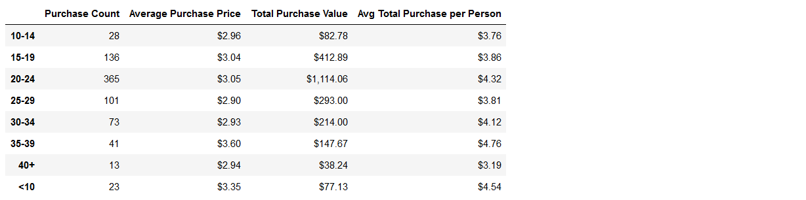

# Analyzing Data Using Pandas

Here we are analyzing video game data. We get data from a CSV file that contains player information including screenname, gender, video games purchased. Using this data, we will use Pandas to calculate the following:

## Number of Players

## Purchasing Analysis

## Gender Demographics

## Purchasing Analysis by Gender

## Age Demographics

## Purchasing Analysis by Age

## Top Spenders

## Most Popular Video Games

## Most Profitable Video Games
